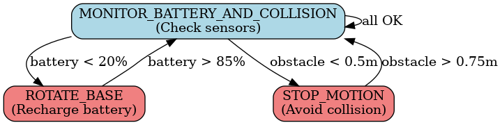
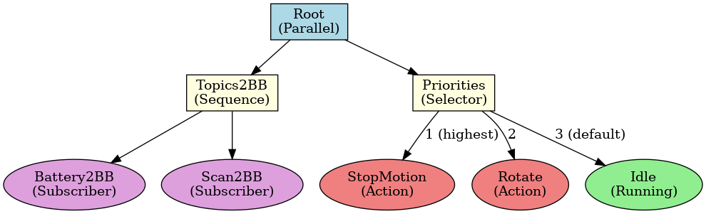

# Robot Safety System - SMACH vs Behavior Trees

## Assignment Overview

This assignment implements robot safety functionalities using two different approaches: Finite State Machines (SMACH) and Behavior Trees (py_trees). Both implementations handle low battery management and collision avoidance for the Robile robot.

## Project Structure
```
.
├── ros_ws/                                           # ROS2 workspace
│   └── src/
│       ├── robile_battery_simulator/                 # Battery physics simulation
│       ├── robile_safety_smach/                      # SMACH implementation
│       ├── robile_safety_bt/                         # Behavior tree implementation
│       └── robile_safety_system/                     # Launch orchestration
│
├── artifacts/                                        # Generated diagrams
│   ├── fsm_diagram.png                               # Finite State Machine diagram
│   ├── bt_diagram.png                                # Behavior Tree diagram
│   └── graph_vis.py                                  # Diagram generation script
│
├── figures/                                          # Assignment Releated Files (E2X)
├── logos/                                            # # Assignment Releated Files (E2X)
├── .ipynb_checkpoints/                               # Jupyter checkpoints
├── state-machines-and-behaviour-trees.ipynb          # Assignment notebook (Same version with E2X)
│
└── README.md
```

## Build Instructions

Navigate to the ROS2 workspace and build all packages:
```bash
cd ros_ws
colcon build --symlink-install
source install/setup.bash
```

## Execution Instructions

### Step 1: Launch Gazebo Simulation

Start the Robile robot simulation in Gazebo and RViz:
```bash
ros2 launch robile_gazebo gazebo_4_wheel.launch.py
```

### Step 2: Launch Teleoperation (Optional)

For manual robot control during testing:
```bash
ros2 run teleop_twist_keyboard teleop_twist_keyboard
```

### Step 3: Launch Battery Simulator

Start the battery simulation node:
```bash
ros2 launch robile_safety_system battery_only.launch.py
```

### Step 4: Launch Safety System

Choose one of the safety implementations:

**Option A: SMACH State Machine Implementation**
```bash
ros2 launch robile_safety_system safety_smach.launch.py
```

**Option B: Behavior Tree Implementation**
```bash
ros2 launch robile_safety_system safety_bt.launch.py
```

## System Behavior

The safety system monitors two conditions with priority handling:

1. **Collision Detection** (Highest Priority): When an obstacle is detected within 0.5m, the robot immediately stops and remains stationary until the obstacle moves beyond 0.75m.

2. **Low Battery Management**: When battery level drops below 20%, the robot rotates in place to simulate recharging until reaching 85%.

## Architecture Diagrams

### Finite State Machine (SMACH)

The SMACH implementation uses three states with explicit transitions:



**States:**
- **MONITOR_BATTERY_AND_COLLISION**: Continuously checks battery level and laser scan data
- **ROTATE_BASE**: Rotates robot for battery recharging
- **STOP_MOTION**: Stops robot when collision detected

**Transitions:**
- Battery < 20% → ROTATE_BASE
- Battery > 85% → MONITOR
- Obstacle < 0.5m → STOP_MOTION
- Obstacle > 0.75m → MONITOR

### Behavior Tree

The behavior tree uses parallel execution and priority-based selection:



**Structure:**
- **Root (Parallel)**: Runs sensor monitoring and action selection simultaneously
- **Topics2BB (Sequence)**: Updates blackboard with sensor data
  - Battery2BB: Monitors battery level
  - Scan2BB: Monitors laser scan
- **Priorities (Selector)**: Executes highest priority action
  - StopMotion (Priority 1): Handles collisions
  - Rotate (Priority 2): Handles low battery
  - Idle (Priority 3): Default behavior

## Implementation Details

### Package Architecture

- **robile_battery_simulator**: Physics-based battery simulation with configurable drain/charge rates
- **robile_safety_smach**: State machine implementation with explicit state transitions
- **robile_safety_bt**: Behavior tree implementation with blackboard-based communication
- **robile_safety_system**: Launch file orchestration for different configurations

### Configuration

All thresholds are configurable via YAML files in each package's `config/` directory:

- Battery thresholds: 20% (low) / 85% (recharged)
- Collision thresholds: 0.5m (stop) / 0.75m (resume)
- Rotation speed: 5.0 rad/s
- Update rate: 10 Hz

## Testing Commands

**Manually set battery level:**
```bash
ros2 topic pub --once /battery_set std_msgs/msg/Float32 "data: 15.0"
```

**Monitor battery status:**
```bash
ros2 topic echo /battery_level
```

**View robot commands:**
```bash
ros2 topic echo /cmd_vel
```

**Monitor laser scan:**
```bash
ros2 topic echo /scan
```

## Key Differences: SMACH vs Behavior Trees

| Aspect | SMACH | Behavior Trees |
|--------|-------|----------------|
| **Execution** | Sequential (one state at a time) | Parallel (sensors + actions) |
| **Transitions** | Explicit definitions required | Implicit via composites |
| **Priority** | Checked in monitor state | Selector order |
| **Reactivity** | Updates on state transitions | Updates every tick (100ms) |
| **Modularity** | Medium | High |

## Dependencies

- ROS2 Humble
- Python 3.10+
- py_trees
- py_trees_ros
- smach
- robile_gazebo (simulation environment)

## Demo Video

[](https://youtu.be/12EEkJe1wfI)

## Personal Notes For Docker

```bash
docker compose up -d prod
docker compose exec prod bash
docker compose down
```